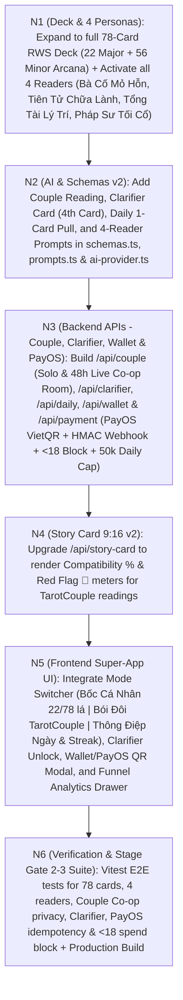

# Execution DAG — Phase 2 (Closed Beta, Analytics & Retention) & Phase 3 (78 Cards, 4 Readers, TarotCouple Co-op, Clarifier & PayOS VietQR)

## DAG Nodes

```mermaid
flowchart TD
    P1["N1 (Deck & 4 Personas): Expand to full 78-Card RWS Deck (22 Major + 56 Minor Arcana) + Activate all 4 Readers (Bà Cố Mỏ Hỗn, Tiên Tử Chữa Lành, Tổng Tài Lý Trí, Pháp Sư Tối Cổ)"]
    P2["N2 (AI & Schemas v2): Add Couple Reading, Clarifier Card (4th Card), Daily 1-Card Pull, and 4-Reader Prompts in schemas.ts, prompts.ts & ai-provider.ts"]
    P3["N3 (Backend APIs - Couple, Clarifier, Wallet & PayOS): Build /api/couple (Solo & 48h Live Co-op Room), /api/clarifier, /api/daily, /api/wallet & /api/payment (PayOS VietQR + HMAC Webhook + <18 Block + 50k Daily Cap)"]
    P4["N4 (Story Card 9:16 v2): Upgrade /api/story-card to render Compatibility % & Red Flag 🚩 meters for TarotCouple readings"]
    P5["N5 (Frontend Super-App UI): Integrate Mode Switcher (Bốc Cá Nhân 22/78 lá | Bói Đôi TarotCouple | Thông Điệp Ngày & Streak), Clarifier Unlock, Wallet/PayOS QR Modal, and Funnel Analytics Drawer"]
    P6["N6 (Verification & Stage Gate 2-3 Suite): Vitest E2E tests for 78 cards, 4 readers, Couple Co-op privacy, Clarifier, PayOS idempotency & <18 spend block + Production Build"]

    P1 --> P2
    P2 --> P3
    P3 --> P4
    P4 --> P5
    P5 --> P6
```
