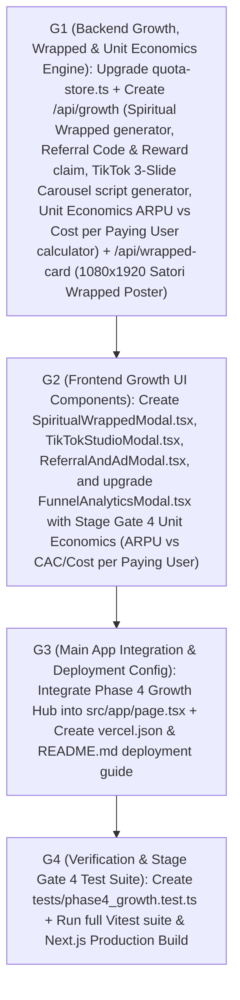

# Execution DAG — Phase 4 (Growth Engine: Spiritual Wrapped, TikTok/Reels Carousel Studio, Referral Loop, Rewarded Ads & Unit Economics LTV/CAC Gate)

## DAG Nodes

```mermaid
flowchart TD
    G1["G1 (Backend Growth, Wrapped & Unit Economics Engine): Upgrade quota-store.ts + Create /api/growth (Spiritual Wrapped generator, Referral Code & Reward claim, TikTok 3-Slide Carousel script generator, Unit Economics ARPU vs Cost per Paying User calculator) + /api/wrapped-card (1080x1920 Satori Wrapped Poster)"]
    G2["G2 (Frontend Growth UI Components): Create SpiritualWrappedModal.tsx, TikTokStudioModal.tsx, ReferralAndAdModal.tsx, and upgrade FunnelAnalyticsModal.tsx with Stage Gate 4 Unit Economics (ARPU vs CAC/Cost per Paying User)"]
    G3["G3 (Main App Integration & Deployment Config): Integrate Phase 4 Growth Hub into src/app/page.tsx + Create vercel.json & README.md deployment guide"]
    G4["G4 (Verification & Stage Gate 4 Test Suite): Create tests/phase4_growth.test.ts + Run full Vitest suite & Next.js Production Build"]

    G1 --> G2
    G2 --> G3
    G3 --> G4
```
