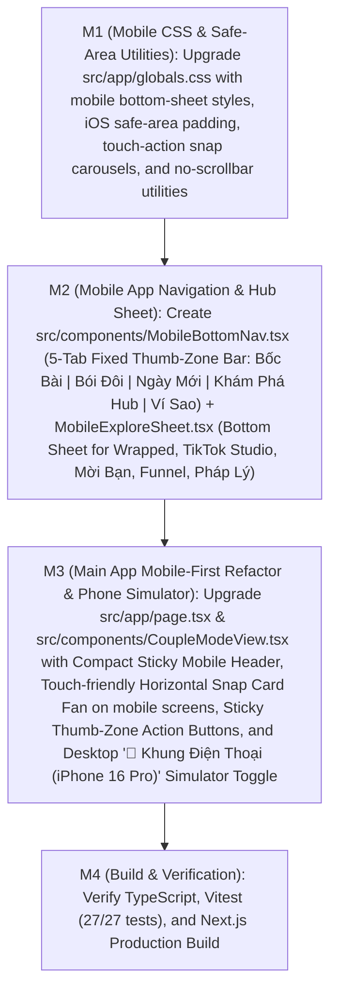

# Execution DAG — Phase 5 (Mobile-Native App Shell, Thumb-Zone Bottom Tab Bar, Touch Card Carousel & iPhone Frame Simulator)

## DAG Nodes

```mermaid
flowchart TD
    M1["M1 (Mobile CSS & Safe-Area Utilities): Upgrade src/app/globals.css with mobile bottom-sheet styles, iOS safe-area padding, touch-action snap carousels, and no-scrollbar utilities"]
    M2["M2 (Mobile App Navigation & Hub Sheet): Create src/components/MobileBottomNav.tsx (5-Tab Fixed Thumb-Zone Bar: Bốc Bài | Bói Đôi | Ngày Mới | Khám Phá Hub | Ví Sao) + MobileExploreSheet.tsx (Bottom Sheet for Wrapped, TikTok Studio, Mời Bạn, Funnel, Pháp Lý)"]
    M3["M3 (Main App Mobile-First Refactor & Phone Simulator): Upgrade src/app/page.tsx & src/components/CoupleModeView.tsx with Compact Sticky Mobile Header, Touch-friendly Horizontal Snap Card Fan on mobile screens, Sticky Thumb-Zone Action Buttons, and Desktop '📱 Khung Điện Thoại (iPhone 16 Pro)' Simulator Toggle"]
    M4["M4 (Build & Verification): Verify TypeScript, Vitest (27/27 tests), and Next.js Production Build"]

    M1 --> M2
    M2 --> M3
    M3 --> M4
```
